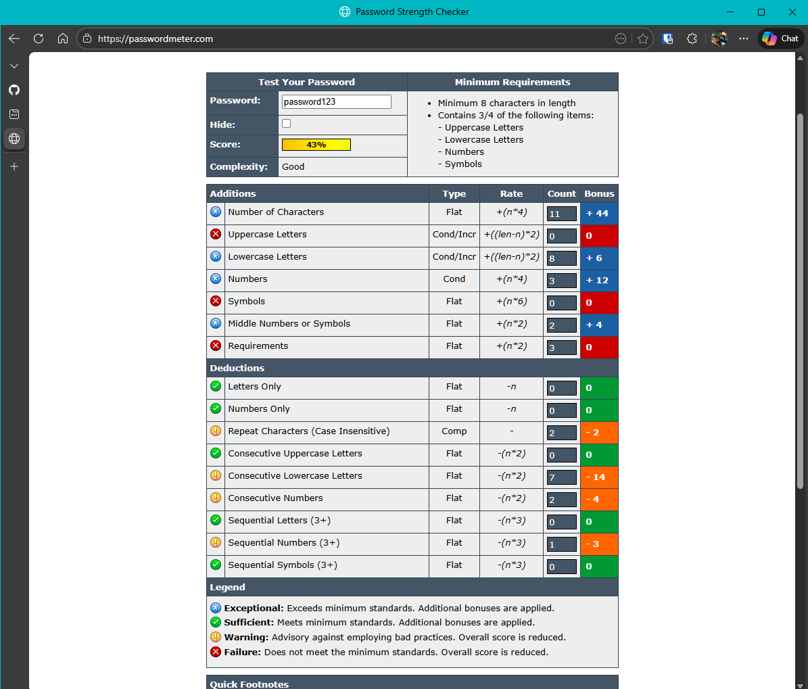
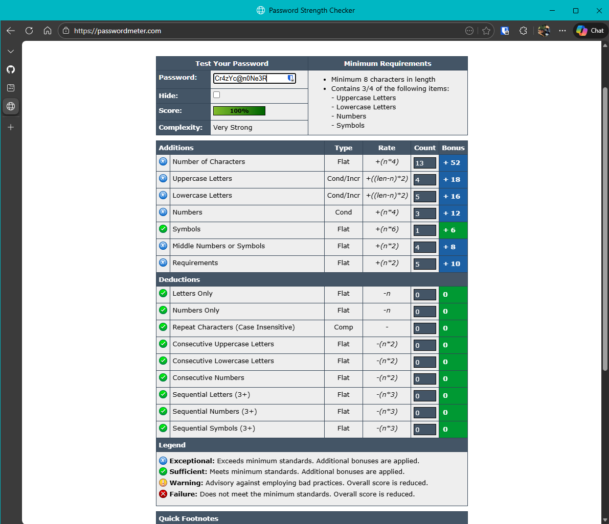
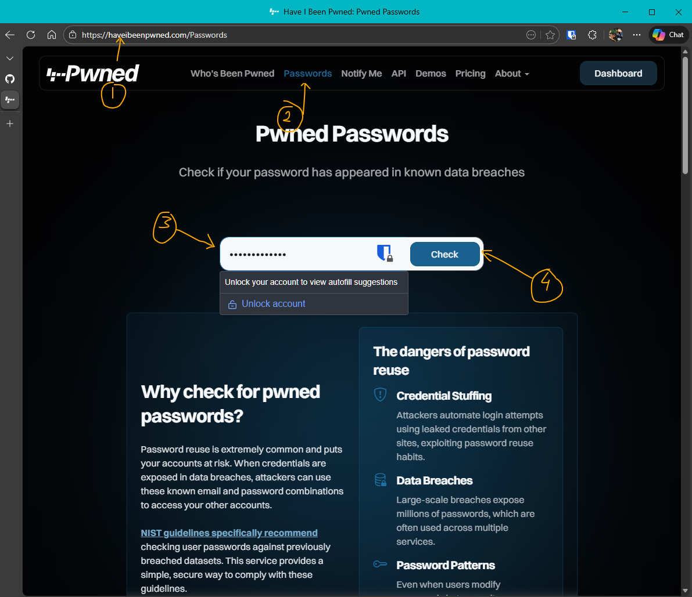

# Create a Strong Password and Evaluate Its Strength

## 📌 Objective
Demonstrate how to create a strong password, evaluate its complexity using online tools, and verify its uniqueness against known data breaches.

## 🛠️ Background
In the past, simple passwords like `12345678` or `password` were considered "secure." Today, such choices are highly risky due to advanced cracking tools and smarter attackers. Modern password policies emphasize:
- Minimum length (often 12–16 characters).
- Combination of uppercase, lowercase, numbers, and special characters.
- Avoidance of dictionary words and predictable patterns.
- Regular password expiration and updates.
- Multi-Factor Authentication (MFA) as a mandatory safeguard.
- Security questions or unique identifiers to strengthen authentication.

**Examples of organizational standards:**
- **NIST Guidelines (SP 800-63B):** Minimum 8 characters, encourage longer passphrases, block commonly used passwords.
- **Microsoft Recommendations:** At least 14 characters, avoid reuse, enable MFA.
- **OWASP Authentication Cheat Sheet:** Use strong hashing, enforce complexity, and prevent password hints.

## 🎯 Steps Performed

1. **Open Password Meter**  
   Used [PasswordMeter](https://passwordmeter.com) to check minimum password requirements.  
   

2. **Test Weak Password**  
   Entered `password123`.  
   - Result: Failed multiple requirements (red crosses).  
   - Weak due to predictable word + simple digits.  
   

3. **Create Strong Password**  
   Entered `Cr4zYc@n0Ne3R`.  
   - Followed rules: uppercase, lowercase, numbers, special characters.  
   - Achieved **100% complexity score**.  
   - Minor repetition noted, but case variation improved uniqueness.  
   

4. **Verify Against Breaches**  
   Used [Have I Been Pwned](https://haveibeenpwned.com) → Passwords tab.  
   - Entered the strong password.  
   - Result: **No matches found** in known breaches.  
   - Confirmed uniqueness and security (for now).  
   

## 🔍 Key Findings
- Weak passwords are easily flagged by modern tools and fail basic standards.
- Strong passwords require diversity in character types and sufficient length.
- Even strong passwords should be checked against breach databases.
- Security is not static: passwords must be updated regularly, and MFA should always be enabled.

## 📊 Conclusion
By combining best practices, online evaluation tools, and breach verification:
- We created a **complex, unique password** that meets modern standards.
- Verified it against known leaks to ensure it hasn’t been compromised.
- Reinforced the importance of **MFA and regular updates** for maximum security.

This project demonstrates practical skills in password creation, evaluation, and security awareness — essential for both personal safety and organizational compliance.

---
